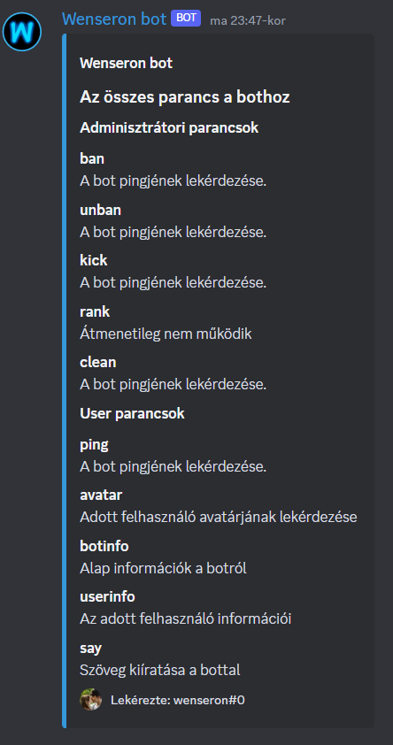

# discordbot.py

Discord Python bot
v0.3 Verzió
___________________________________________
Jelenleg elérhető parancsok

# Adminisztrátori joghoz kötött

=ban Felhasználó kitiltása a szerverről [=ban @Felhasználó]

=kick Felhasználó kirugása a szerverről [=kick @Felhasználó]

=unban Felhasználó kitiltásának feloldása [=unban @Felhasználó]

=rank (Ismét működik) Kért rang hozzáadása a felhasználónak [=rank @felhasznalónev @rankneve]

=clean Chat törlése [=clean 10 (sor)]

# User parancsok

=ping Bot pingje

=avatar Kért felhasználó avatárjának lekérése [Avatar @felhasználó]

=userinfo [Felhasználó]

=botinfo (Információk a botról)

=say (Szöveg)

